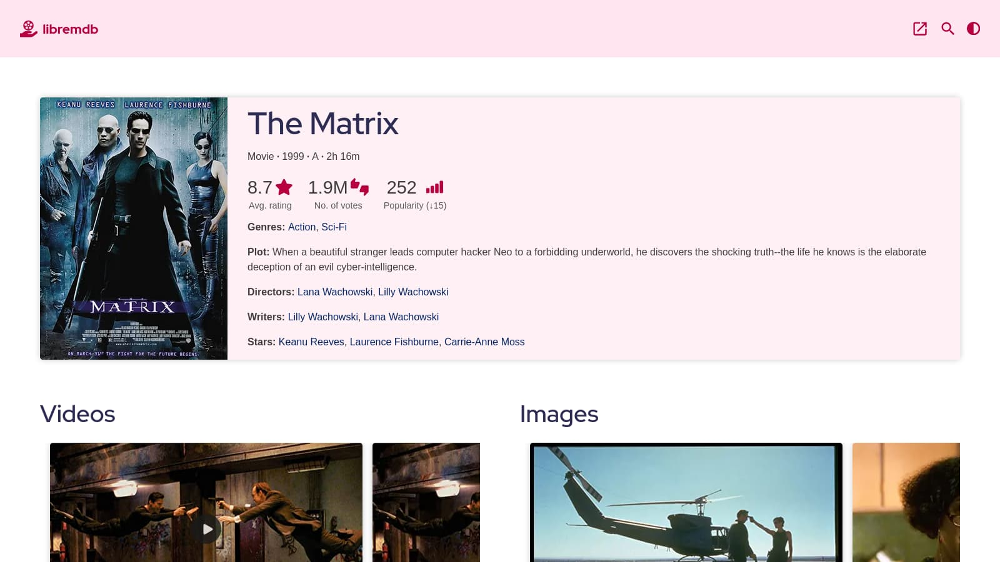
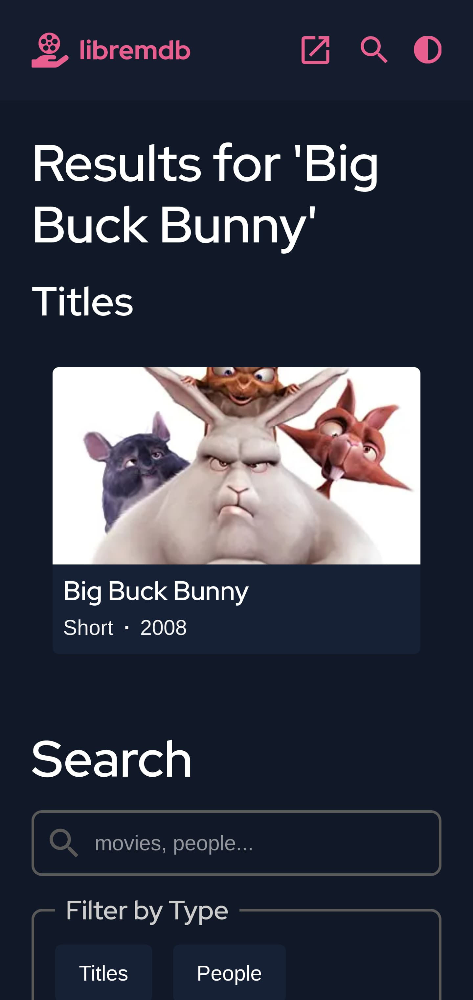

# libremdb

A free & open source IMDb front-end.

Inspired by projects like [teddit](https://codeberg.org/teddit/teddit), [nitter](https://github.com/zedeus/nitter) and [many others](#similar-projects).

|                                                                                                          |                                                                                                        |
| -------------------------------------------------------------------------------------------------------- | ------------------------------------------------------------------------------------------------------ |
|  |  |

---

## Some Features

- No ads or tracking  
  Browse any movie info without being tracked or bombarded by annoying ads.
- Modern interface  
  Modern interface with curated colors supporting both dark and light themes.
- Responsive design  
  Be it your small mobile or big computer screen, it's fully responsive.
- Lightweight  
  _[Up movie page](https://imdb.com/title/tt1049413/)_  
  (tested on Firefox v104; without scroll; simulated regular 4g)

  | Network tab stats        | libremdb | IMDb   |
  | ------------------------ | -------- | ------ |
  | no. of requests          | 22       | 180    |
  | data transfered(gzipped) | 468KB    | 1.88MB |
  | load event fired in      | 6.22s    | 10.01s |

---

## Instances

<!-- prettier-ignore -->
| Instance URL | Region | Notes |
| ------------ | ------ | ----- |
| 1. Clearnet | | |
| [libremdb.iket.me](https://libremdb.iket.me) | Canada  | Operated by me |
| [libremdb.pussthecat.org](https://libremdb.pussthecat.org) | Germany | Operated by [PussTheCat.org](https://pussthecat.org/) |
| [libremdbeu.herokuapp.com](https://libremdbeu.herokuapp.com) | Europe | Operated by [toyboatcash](https://github.com/toyboatcash) |
| [lmdb.tokhmi.xyz](https://lmdb.tokhmi.xyz) | U.S. | Operated by [Tokhmi](https://tokhmi.xyz) |
| [libremdb.esmailelbob.xyz](https://libremdb.esmailelbob.xyz) | Canada | Operated by [Esmail EL BoB](https://esmailelbob.xyz) |
| [ld.vern.cc](https://ld.vern.cc) | US | Operated by [~vern](https://vern.cc) |
| [binge.whatever.social](https://binge.whatever.social) | US & Germany | Operated by [Whatever Social](https://whatever.social) |
| [libremdb.lunar.icu](https://libremdb.lunar.icu/) | Germany (Cloudflare) | Operated by [lunar.icu](https://lunar.icu/) |
| [libremdb.jeikobu.net](https://libremdb.jeikobu.net) | Germany (Cloudflare) | Operated by [shindouj](https://github.com/shindouj) |
| [lmdb.hostux.net](https://lmdb.hostux.net) | France | Operated by [Hostux.net](https://hostux.net) |
| 2. Onion | | |
| [libremdb.esmail5pdn24shtvieloeedh7ehz3nrwcdivnfhfcedl7gf4kwddhkqd.onion](http://libremdb.esmail5pdn24shtvieloeedh7ehz3nrwcdivnfhfcedl7gf4kwddhkqd.onion) | Canada | Operated by [Esmail EL BoB](https://esmailelbob.xyz) |
| [ld.vernccvbvyi5qhfzyqengccj7lkove6bjot2xhh5kajhwvidqafczrad.onion](http://ld.vernccvbvyi5qhfzyqengccj7lkove6bjot2xhh5kajhwvidqafczrad.onion) | US  | Operated by [~vern](https://vern.cc) |
| 3. I2P | | |
| [vernz3ubrntql4wrgyrssd6u3qzi36zrhz2agbo6vibzbs5olk2q.b32.i2p](http://vernz3ubrntql4wrgyrssd6u3qzi36zrhz2agbo6vibzbs5olk2q.b32.i2p) | US  | Operated by [~vern](https://vern.cc) |

---

## Questions you might have

- How do I use it?  
  Replace `imdb.com` in any IMDb URL with any of the instances. For example: '[imdb.com/title/tt1049413](https://imdb.com/title/tt1049413/)' to '[libremdb.iket.me/title/tt1049413](https://libremdb.iket.me/title/tt1049413/)'.  
  To avoid changing the URLs manually, you can use [extensions](#automatic-redirection).

- Why is it so slow?  
  Whenever you request info about a movie/show on libremdb, 4 trips are made(2 between your browser and libremdb's server, and 2 between libremdb's server and IMDb's server) instead of the usual 2 trips when you visit a website. For this reason there's a noticable delay. This is a bit of inconvenience you'll have to face should you wish to use this website.

- It doesn't have all routes.  
  I'll implement more with time :)

- Is content served from third-parties, like Amazon?  
  Nope, libremdb proxies all image and video requests through the instance to avoid exposing your IP address, browser information and other personally identifiable metadata ([Contributor](https://github.com/httpjamesm)).

- Why not just use IMDb?  
  Refer to the [features section](#some-features) above.

- Why didn't you use other databases like [TMDB](https://www.themoviedb.org/) or [OMDb](https://www.omdbapi.com/)?  
  IMDb simply has superior dataset compared to all other alternatives. With that being said, I'd encourage you to check out those alternatives too.

---

## Privacy

- Information collected:  
  None.

- Information stored in your browser:  
  A key named 'theme' is stored in Local Storage provided by your browser, if you ever override the default theme. To remove it, go to site data settings, and clear the data for this website. To permamently disable libremdb from storing your theme prefrences, either turn off JavaScript or disable access to Local Storage for libremdb.

- Information collected by other services:  
  None. libremdb proxies images anonymously through the instance for maximum privacy ([Contributor](https://github.com/httpjamesm)).

---

## To-Do

- [ ] add advanced search route
- [x] add did you know and reviews on movie info page
- [x] add a way to see trailer and other videos
- [ ] implement movie specific routes like:

  - [ ] reviews(including critic reviews)
  - [ ] video & image gallery
  - [ ] sections under 'did you know'
  - [ ] release info
  - [ ] parental guide

- [ ] implement other routes like:

  - [ ] lists
  - [ ] moviemeter
  - [ ] person info(includes directors and actors)
  - [ ] company info
  - [ ] user info

- [ ] use redis, or any other caching strategy
- [x] implement a better installation method
- [x] serve images and videos from libremdb itself

---

## Installation

As libremdb is made with Next.js, you can deploy it anywhere where Next.js is supported. Below are a few other methods:

### Manual

1. Install Node.js and Git.  
   for Node.js, visit [their website](https://nodejs.org/en/).  
   for Git, run `sudo apt install git` if you're on a Debian-based distro. Else visit [their website](https://git-scm.com/).

2. Install redis(optional).  
   You can install redis from [here](https://redis.io).

3. Clone and set up the repo.

   ```bash
   git clone https://github.com/zyachel/libremdb.git # replace github.com with codeberg.org if you wish so.
   cd libremdb
   # change the configuration file to your liking.
   cp .env.local.example .env.local
   # replace 'pnpm' with yarn or npm if you use those.
   pnpm install
   pnpm build
   pnpm start
   # optional: if you're using redis
   redis-server
   ```

libremdb will start running at http://localhost:3000.  
To change port, modify the last command like this: `pnpm start -- -p <port-number>`.

### Docker (Local)

You can build the docker image using the provided Dockerfile(thanks to [@httpjamesm](https://github.com/httpjamesm)) and set it up using the [example docker-compose file](./docker-compose.example.yml).

Change the docker-compose file to your liking and run `docker-compose up -d` to start the container, that's all!

### Docker (Built)

There's a [docker image](https://github.com/PussTheCat-org/docker-libremdb-quay) made by [@TheFrenchGhosty](https://github.com/TheFrenchGhosty) for [PussTheCat.org's instance](https://libremdb.pussthecat.org). You can use that as well.

## Miscellaneous

### Automatic redirection

- [Redirector](https://github.com/einaregilsson/Redirector)  
  config:

  ```
  Description: redirect IMDb to libremdb
  Example URL: https://www.imdb.com/title/tt0258463/?ref_=tt_sims_tt_t_4
  Include pattern: https?:\/\/(www\.)?imdb\.com\/(.*)
  Redirect to: https://libremdb.iket.me/$2
  Pattern type: Regular Expression
  ```

- [LibRedirect](https://github.com/libredirect/libredirect/)

- [Privacy Redirector](https://github.com/dybdeskarphet/privacy-redirector)

### Similar projects

- [Teddit](https://codeberg.org/teddit/teddit)  
  Teddit is an alternative Reddit front-end focused on privacy.
- [Nitter](https://github.com/zedeus/nitter)  
  Nitter is a free and open source alternative Twitter front-end focused on privacy.
- [Bibliogram](https://sr.ht/~cadence/bibliogram/)  
  Bibliogram is an alternative front-end for Instagram.
- [Invidious](https://invidious.io)  
  Invidious is an alternative front-end to YouTube.
- [Libreddit](https://github.com/spikecodes/libreddit)  
  Libreddit is an alternative private front-end to Reddit.
- [Scribe](https://git.sr.ht/~edwardloveall/scribe)  
  Scribe is an alternative Medium frontend.
- [full list &rarr;](https://github.com/digitalblossom/alternative-frontends)

---

## Contact

I'm availabe on [[matrix]](https://matrix.to/#/@ninal:matrix.org) and [email](mailto:aricla@protonmail.com) in case you wish to contact me personally.

---

## License

Licensed under GNU AGPLv3.  
See [License](./LICENSE) for full legalese.
