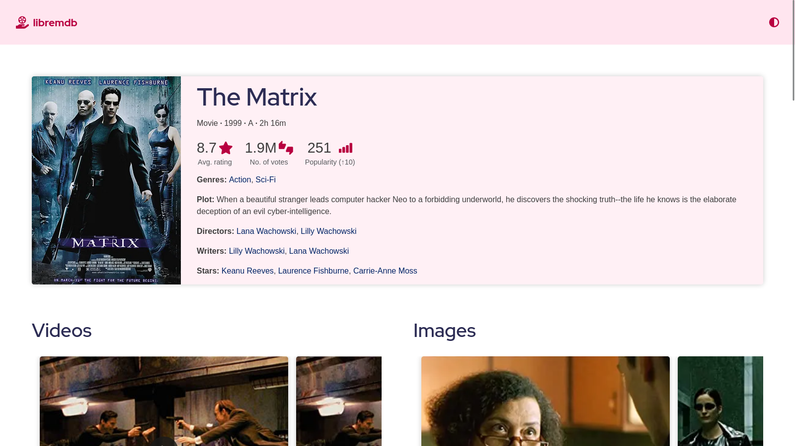

# libremdb

A FOSS alternative front-end to IMDb.

Inspired by projects like [teddit](https://codeberg.org/teddit/teddit), [nitter](https://github.com/zedeus/nitter) and [many others](#similar-projects).

<br/>


---

## Features

- No ads or tracking  
  Browse any movie info without being tracked or bombarded by annoying ads.
- No connection to IMDb  
  All requests go through the backend; client never talks to IMDb except for a bunch of requests to `m.media-amazon.com` for images.
- No JavaScript required  
  Just a few linesof code(~30) to save theme preference, which itself is optional.
- Modern interface  
  Modern interface with curated colors supporting both dark and light themes.
- Responsive design  
  Be it your small mobile or big computer screen, it's fully responsive.
- Lightweight  
  _[Up movie page](https://imdb.com/title/tt1049413/)_  
  | | libremdb | IMDb |
  | --------------- | -------- | ------ |
  | no. of requests | ~35 | ~280 |
  | data consumed | 1.35MB | 7.75MB |

---

## Instances

| Instance URL                     | Region        | Notes                                                     |
| -------------------------------- | ------------- | --------------------------------------------------------- |
| https://libremdb.herokuapp.com   | United States | Official; Hosted on Heroku                                |
| https://libremdb.pussthecat.org  | Germany       | Operated by [PussTheCat.org](https://pussthecat.org/)     |
| https://libremdbeu.herokuapp.com | Europe        | Operated by [toyboatcash](https://github.com/toyboatcash) |
| https://lmdb.tokhmi.xyz/         | U.S.          | Operated by [Tokhmi](https://tokhmi.xyz)                  |
| https://libremdb.esmailelbob.xyz/         | Canada          | Operated by [Esmail EL BoB](https://esmailelbob.xyz)                  |
| http://libremdb.lqs5fjmajyp7rvp4qvyubwofzi6d4imua7vs237rkc4m5qogitqwrgyd.onion/         | Canada          | Operated by [Esmail EL BoB](https://esmailelbob.xyz)                  |

---

## FAQs

- Why is it so slow?  
  Whenever you request info about a movie/show on libremdb, 4 trips are made(2 between your browser and libremdb's server, and 2 between libremdb's server and IMDb's server) instead of the usual 2 trips when you visit a website. For this reason there's a noticable delay. This is a bit of inconvenience you'll have to face should you wish to use this website.

- It doesn't have all routes.  
  I think most of the people just check IMDb to get a quick glimpse of a movie/show. That's why there is just one route for now. However, I will try to implement other important routes if time allows. Keep an eye on [To-Do](#to-do) section.

- Why is it connecting to `m.media-amazon.com`?  
  For now, images are directly served from amazon. If I have enough time in the future, I'll implement a way to serve the images from libremdb instead.

- Will amazon track me then?  
  They may log your IP address. I'd recommend using a VPN for mitigating this risk.

- Why not just use IMDb?  
  Refer to the [features section](#features) above.
- Why didn't you use other databases like [TMDB](https://www.themoviedb.org/) or [OMDb](https://www.omdbapi.com/)?  
  IMDb simply has superior dataset compared to all other alternatives. With that being said, I'd encourage you to check out those alternatives too.

---

## Privacy

In short: libremdb doesn't collect any data at all.

- Data you directly provide: None.
- Data you passively provide: A stack trace is logged to console on the server if you hit some error route.
- Data stored in your browser: To remember theme preferences, the website stores a key named 'theme' in Local Storage provided by your browser. Apart from that, there is nothing stored in your browser.
- Data collected by other services: libremdb connects to `m.media-amazon.com` for fetching images. So, Amazon might log your IP address. If you use the official instance which is deployed on Heroku, then Heroku might also log you IP address. You're advised to follow due precaution.

---

## To-Do

### soon

- [ ] add advanced search route
- [ ] add did you know and reviews on movie info page
- [ ] implement routes for reviews, quotes, goofs, trivia and crazy credits

### at a later stage

- [ ] use redis
- [x] implement a better installation method
- [ ] serve images from libremdb itself
- [ ] add a way to see trailer and other videos
- [ ] implement other trivial routes

---

## Installation

### Manual

1. Install Node.js and Git.  
   for Node.js, visit [their website](https://nodejs.org/en/).  
   for Git, run `sudo apt install git` if you're on a Debian-based distro. Else visit [their website](https://git-scm.com/).

2. Clone and set up the repo.

   ```bash
   git clone https://github.com/zyachel/libremdb.git # replace gituhb.com with codeberg.org if you wish so.
   cd libremdb
   cp config.env.template config.env # you can make necessary changes
   # if you use npm, change 'pnpm' to 'npm run' here as well as in package.json
   pnpm install
   pnpm start
   ```

libremdb will start running at http://localhost:3000.

### Docker

There's a [docker image](https://github.com/PussTheCat-org/docker-libremdb-quay) made by [@TheFrenchGhosty](https://github.com/TheFrenchGhosty) for [PussTheCat.org's instance](https://libremdb.pussthecat.org). You can use that in case you wish to use docker.

---

## Miscellaneous

### Automatic redirection

Use any of these extensions to automatically redirect IMDb URLs to libremdb:

- [Redirector](https://github.com/einaregilsson/Redirector)  
  config:

  ```
  Description: redirect IMDb to libremdb
  Example URL: https://www.imdb.com/title/tt0258463/?ref_=tt_sims_tt_t_4
  Include pattern: https?:\/\/(www\.)?imdb\.com\/title\/([^\?]*)
  Redirect to: https://libremdb.herokuapp.com/title/$2
  Pattern type: Regular Expression
  ```

- [LibRedirect](https://github.com/libredirect/libredirect/)

### Similar projects

- [Teddit](https://codeberg.org/teddit/teddit)  
  Teddit is an alternative Reddit front-end focused on privacy.
- [Nitter](https://github.com/zedeus/nitter)  
  Nitter is a free and open source alternative Twitter front-end focused on privacy.
- [Bibliogram](https://sr.ht/~cadence/bibliogram/)  
  Bibliogram is an alternative front-end for Instagram.
- [Invidious](https://invidious.io)  
  Invidious is an alternative front-end to YouTube.
- [Libreddit](https://github.com/spikecodes/libreddit)  
  Libreddit is an alternative private front-end to Reddit.
- [Scribe](https://git.sr.ht/~edwardloveall/scribe)  
  Scribe is an alternative Medium frontend.
- [full list &rarr;](https://github.com/digitalblossom/alternative-frontends)

---

## Contact

|                         \[matrix\]                         |                          email                           |
| :--------------------------------------------------------: | :------------------------------------------------------: |
|   |  |
| [@ninal:matrix.org](https://matrix.to/#/@ninal:matrix.org) |  [aricla@protonmail.com](mailto:aricla@protonmail.com)   |

---

## License

Licensed under GNU AGPLv3.  
See [License](./LICENSE) for full legalese.
