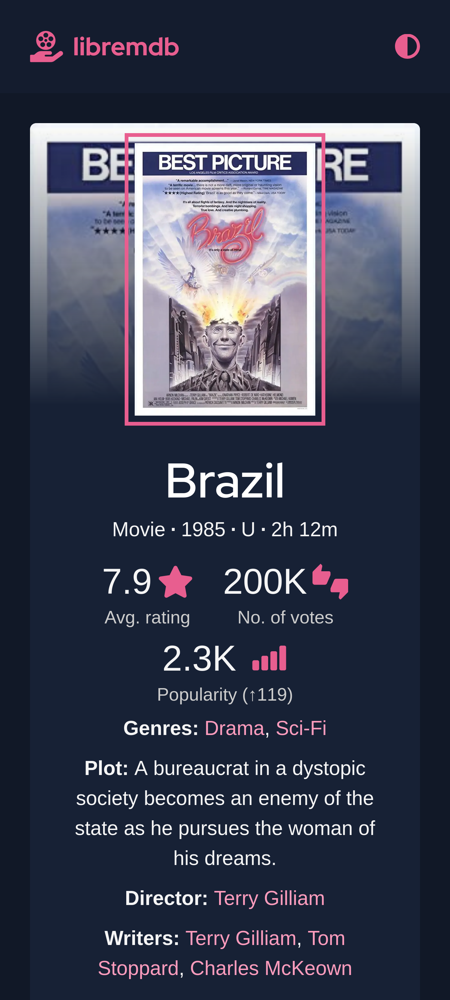

# libremdb

A free & open source IMDb front-end.

Inspired by projects like [teddit](https://codeberg.org/teddit/teddit), [nitter](https://github.com/zedeus/nitter) and [many others](#similar-projects).

_(This is a rewrite of libremdb in Next.js. The information below corresponds to this branch only. I'll make this branch default sometime later.)_
| | |
| -------------------------------------------------------------------------------------------------------- | ------------------------------------------------------------------------------------------------------ |
|  |  |

---

## Some Features

- No ads or tracking  
  Browse any movie info without being tracked or bombarded by annoying ads.
- Modern interface  
  Modern interface with curated colors supporting both dark and light themes.
- Responsive design  
  Be it your small mobile or big computer screen, it's fully responsive.
- Lightweight  
  _[Up movie page](https://imdb.com/title/tt1049413/)_  
  (tested on Firefox v104; without scroll; simulated regular 4g)

  | Network tab stats        | libremdb | IMDb   |
  | ------------------------ | -------- | ------ |
  | no. of requests          | 22       | 180    |
  | data transfered(gzipped) | 468KB    | 1.88MB |
  | load event fired in      | 6.22s    | 10.01s |

---

## Instances

| Instance URL             | Region | Notes          |
| ------------------------ | ------ | -------------- |
| https://libremdb.iket.me | Canada | Operated by me |

---

## Questions you might have

- Why is it so slow?  
  Whenever you request info about a movie/show on libremdb, 4 trips are made(2 between your browser and libremdb's server, and 2 between libremdb's server and IMDb's server) instead of the usual 2 trips when you visit a website. For this reason there's a noticable delay. This is a bit of inconvenience you'll have to face should you wish to use this website.

- It doesn't have all routes.  
  I'll implement more with time :)

- I see connection being made to some Amazon domains.  
  For now, images and videos are directly served from Amazon. If I have enough time in the future, I'll implement a way to serve the images from libremdb instead.

- Will Amazon track me then?  
  They may log your IP address, useragent, and other such
  identifiers. I'd recommend using a VPN, or accessing the website through TOR for mitigating this risk.

- Why not just use IMDb?  
  Refer to the [features section](#features) above.
- Why didn't you use other databases like [TMDB](https://www.themoviedb.org/) or [OMDb](https://www.omdbapi.com/)?  
  IMDb simply has superior dataset compared to all other alternatives. With that being said, I'd encourage you to check out those alternatives too.

---

## Privacy

- Information collected:  
  None.

- Information stored in your browser:  
  A key named 'theme' is stored in Local Storage provided by your browser, if you ever override the default theme. To remove it, go to site data settings, and clear the data for this website. To permamently disable libremdb from storing your theme prefrences, either turn off JavaScript or disable access to Local Storage for libremdb.

- Information collected by other services:  
  libremdb connects to 'media-amazon.com' and 'media-imdb.com' for fetching images and videos. So, Amazon might log your IP address, and other information(such as http headers) sent by your browser.

---

## To-Do

### soon

- [ ] add advanced search route
- [x] add did you know and reviews on movie info page
- [ ] implement routes for reviews, quotes, goofs, trivia and crazy credits

### at a later stage

- [ ] use redis
- [ ] implement a better installation method
- [ ] serve images from libremdb itself
- [x] add a way to see trailer and other videos
- [ ] implement other trivial routes

---

## Installation

As libremdb is made with Next.js, you can deploy it anywhere where Next.js is supported. Below are a few other methods:

### Manual

1. Install Node.js and Git.  
   for Node.js, visit [their website](https://nodejs.org/en/).  
   for Git, run `sudo apt install git` if you're on a Debian-based distro. Else visit [their website](https://git-scm.com/).

2. Clone and set up the repo.

   ```bash
   git clone https://github.com/zyachel/libremdb.git # replace github.com with codeberg.org if you wish so.
   cd libremdb
   # optional configuration
   cp .env.local.example .env.local
   # replace 'pnpm' with yarn or npm if you use those
   pnpm install
   pnpm build
   pnpm start
   ```

libremdb will start running at http://localhost:3000.

### Docker

No image available yet.

---

## Miscellaneous

### Automatic redirection

- [Redirector](https://github.com/einaregilsson/Redirector)  
  config:

  ```
  Description: redirect IMDb to libremdb
  Example URL: https://www.imdb.com/title/tt0258463/?ref_=tt_sims_tt_t_4
  Include pattern: https?:\/\/(www\.)?imdb\.com\/([^\?]*)
  Redirect to: https://libremdb.iket.me/$2
  Pattern type: Regular Expression
  ```

### Similar projects

- [Teddit](https://codeberg.org/teddit/teddit)  
  Teddit is an alternative Reddit front-end focused on privacy.
- [Nitter](https://github.com/zedeus/nitter)  
  Nitter is a free and open source alternative Twitter front-end focused on privacy.
- [Bibliogram](https://sr.ht/~cadence/bibliogram/)  
  Bibliogram is an alternative front-end for Instagram.
- [Invidious](https://invidious.io)  
  Invidious is an alternative front-end to YouTube.
- [Libreddit](https://github.com/spikecodes/libreddit)  
  Libreddit is an alternative private front-end to Reddit.
- [Scribe](https://git.sr.ht/~edwardloveall/scribe)  
  Scribe is an alternative Medium frontend.
- [full list &rarr;](https://github.com/digitalblossom/alternative-frontends)

---

## Contact

I'm availabe on [[matrix]](https://matrix.to/#/@ninal:matrix.org) and [email](mailto:aricla@protonmail.com) in case you wish to contact me personally.

---

## License

Licensed under GNU AGPLv3.  
See [License](./LICENSE) for full legalese.
